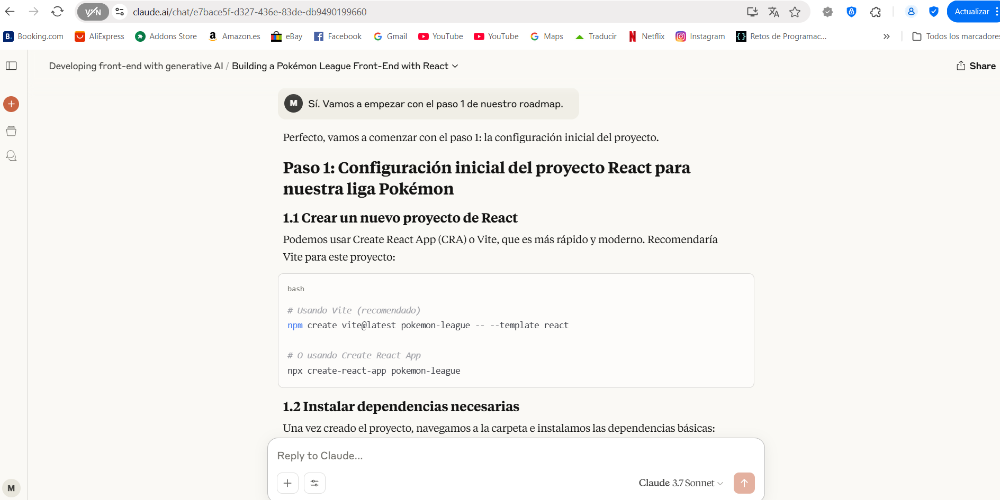
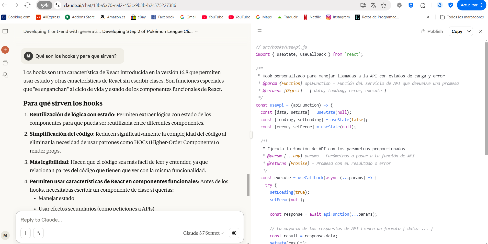
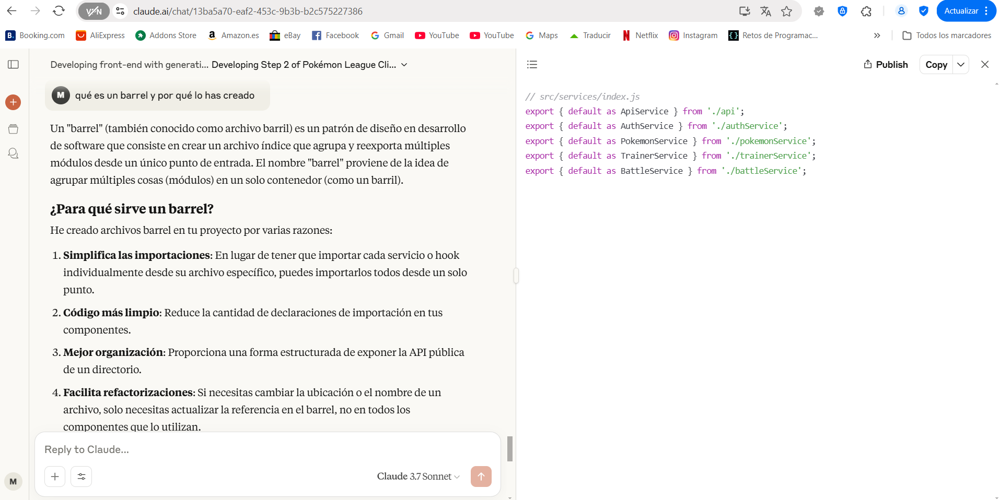
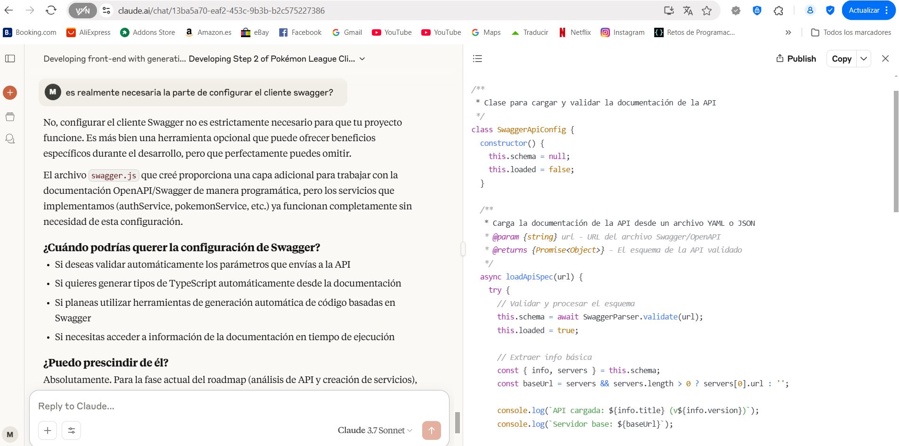
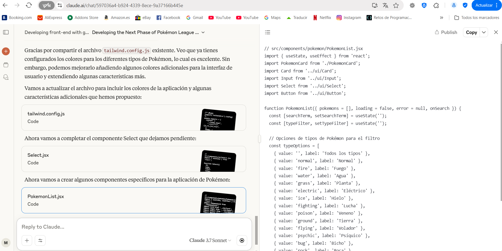
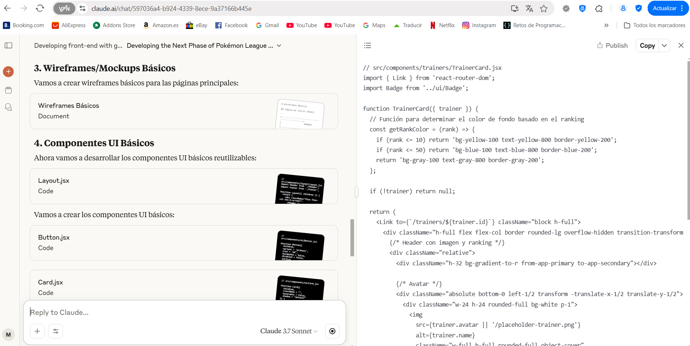
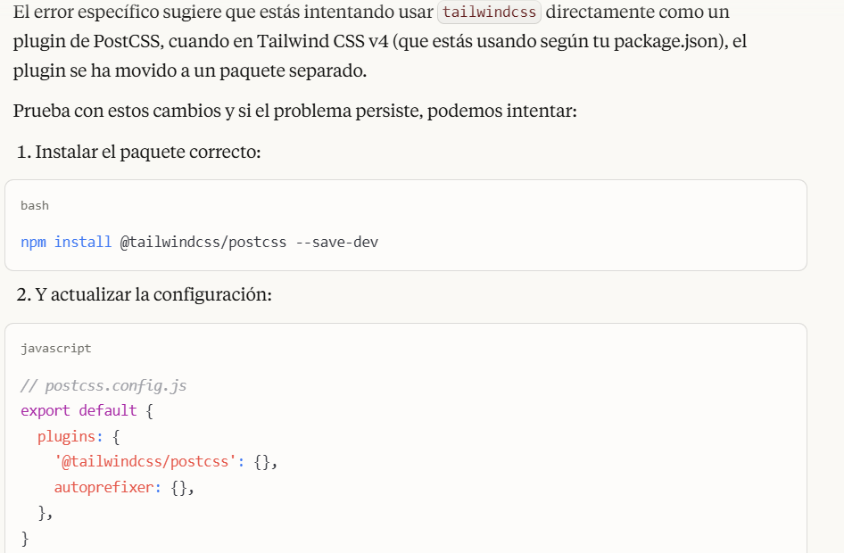

# Proyecto Pokemon League - Frontend con IA

## 1. Descripción del Modelo IA Seleccionado

Para este proyecto, seleccioné **Claude 3.7 Sonnet** desarrollado por Anthropic como mi asistente de IA. La elección se basó en varias consideraciones clave:

### Ventajas (PROS):
- **Capacidades avanzadas de programación**: Claude demostró un excelente entendimiento de React, Tailwind CSS y conceptos modernos de desarrollo frontend.
- **Razonamiento crítico y honestidad**: A diferencia de modelos como ChatGPT que tienden a asentir sistemáticamente, Claude cuestiona propuestas que no son adecuadas para el enfoque buscado, aportando una perspectiva más equilibrada.
- **Análisis de archivos**: Permite cargar archivos directamente para que los revise y detecte posibles fallos, lo que fue crucial para diagnosticar problemas de configuración.
- **Creación de proyectos**: Ofrece soporte para ayudar en la creación de proyectos completos, no solo fragmentos de código.
- **Artefactos separados**: Genera el código en artefactos separados del cuerpo principal de la conversación, mejorando enormemente la comprensión y facilitando la implementación.
- **Rendimiento estable**: A diferencia de alternativas como Deepseek, los servidores de Claude no colapsan con facilidad, lo que permite un flujo de trabajo más consistente.

### Desventajas (CONTRAS):
- **Tendencia a la sobreingeniería**: Suele añadir capas de abstracción y complejidad no solicitadas, lo que hace que el desarrollo muchas veces se alargue innecesariamente.
- **Invención de código existente**: A la hora de resolver errores, tiende a proponer nuevo código en lugar de solicitar el existente, lo que puede generar inconsistencias y requiere recordarle constantemente este aspecto.
- **Base de conocimiento no actualizada**: Su entrenamiento no incluye las versiones más recientes de muchas tecnologías (como Laravel 12 o Tailwind 4), lo que causa dificultades para resolver problemas que tienen soluciones conocidas en las versiones actuales.

En conclusión, el uso de Claude 3.7 Sonnet en el desarrollo del proyecto ha sido muy útil y demuestra ser una herramienta poderosa, pero requiere supervisión constante y revisión crítica tanto del código generado como de las respuestas proporcionadas.

## 2. Registro de Interacciones Significativas

Durante el desarrollo del frontend para la Liga Pokemon, mantuve varias conversaciones significativas con Claude. A continuación, destaco las más relevantes:

### Configuración Inicial del Proyecto

Claude proporcionó una guía estructurada para crear el proyecto React con Vite, recomendando comandos específicos y explicando las diferencias entre las opciones de configuración.

<div align="center">
  
  <p><em>Claude guiando la configuración inicial del proyecto con Vite</em></p>
</div>

### Explicación y Desarrollo de Hooks Personalizados

Claude no solo proporcionó código sino que explicó conceptos fundamentales de React, como los hooks y para qué sirven, creando hooks personalizados para manejar las llamadas a la API.

<div align="center">
  
  <p><em>Explicación detallada sobre hooks en React y creación de un hook personalizado para llamadas a la API</em></p>
</div>

### Análisis de Necesidades y Optimización

Claude analizó críticamente las necesidades del proyecto, cuestionando si ciertas implementaciones como la configuración de Swagger eran realmente necesarias, ofreciendo alternativas más sencillas cuando era apropiado.

<div align="center">
  
  <p><em>Claude cuestionando la necesidad de implementar Swagger y sugiriendo enfoques alternativos</em></p>
</div>

### Desarrollo de Componentes Específicos para la Aplicación Pokémon

Claude desarrolló componentes específicos para la aplicación, como PokemonList.jsx, adaptando el diseño y la funcionalidad a las necesidades particulares del proyecto de la Liga Pokémon.

<div align="center">
  
  <p><em>Desarrollo del componente PokemonList con filtrado por tipo de Pokémon</em></p>
</div>

### Creación de Componentes UI Reutilizables

Claude propuso un enfoque modular con componentes UI básicos reutilizables, como TrainerCard, que facilitarían el mantenimiento y la consistencia del diseño.

<div align="center">
  
  <p><em>Diseño e implementación del componente TrainerCard con estilos condicionales según el ranking</em></p>
</div>

### Solución de Errores de Configuración con Tailwind CSS

Uno de los desafíos más significativos fue resolver errores persistentes en la configuración de Tailwind CSS. Claude diagnosticó el problema relacionado con la versión 4 de Tailwind y propuso una solución adecuada.

<div align="center">
  
  <p><em>Diagnóstico y solución para el error de configuración de Tailwind CSS v4</em></p>
</div>

### Explicación de Patrones de Diseño Avanzados

Claude explicó patrones de diseño avanzados como el patrón "barrel" para la organización del código, describiendo sus ventajas para la mantenibilidad y la organización del proyecto.

<div align="center">
  
  <p><em>Explicación detallada del patrón barrel para exportación de servicios</em></p>
</div>

Estas interacciones demuestran cómo Claude no solo proporcionó código, sino que también aportó explicaciones conceptuales, cuestionó enfoques para optimizar el desarrollo, y resolvió problemas técnicos complejos durante todo el proceso de desarrollo.

## 3. Análisis del Código Generado

El código generado por Claude presentó varias características notables:

### Fortalezas:
- **Código limpio y bien estructurado**: Mantuvo buenas prácticas de React y una estructura clara.
- **Utilización efectiva de Tailwind CSS**: Aprovechó las clases de utilidad para crear un diseño coherente y estilizado.
- **Soluciones adaptadas al proyecto**: Las propuestas fueron específicamente adaptadas a las necesidades del proyecto Pokemon.
- **Pensamiento sistemático**: Abordó los problemas de forma metódica, analizando errores y proponiendo soluciones incrementales.

### Ajustes Necesarios:
- **Reducción de complejidad**: Fue necesario simplificar algunas soluciones que tendían a la sobreingeniería.
- **Configuración del entorno**: Se requirieron ajustes en la configuración de Tailwind y Vite para asegurar la compatibilidad.
- **Actualización de enfoques**: Adaptación de soluciones para trabajar con versiones específicas de las bibliotecas utilizadas.
- **Recordatorio constante**: Fue necesario recordarle que no inventara código ya existente y que solicitara los archivos relevantes antes de proponer cambios.

### Código Destacado:

```jsx
// Ejemplo de la solución para el error "process is not defined"
// vite.config.js
import { defineConfig } from 'vite'
import react from '@vitejs/plugin-react'

export default defineConfig({
  plugins: [react()],
  define: {
    // Añadir esta configuración para proporcionar process.env
    'process.env': {},
  },
})
```

```css
/* Solución para problemas con Tailwind CSS */
/* Modificación de global.css para eliminar directivas @layer conflictivas */
/* Importar fuentes de Google Fonts */
@import url('https://fonts.googleapis.com/css2?family=Inter:wght@300;400;500;600;700&family=Poppins:wght@500;600;700&family=Roboto+Mono&display=swap');

/* Estilos base personalizados sin usar @layer */
html {
  -webkit-font-smoothing: antialiased;
  -moz-osx-font-smoothing: grayscale;
}

body {
  @apply bg-app-background text-app-text;
  @apply font-sans;
}

/* Estilos de componentes personalizados sin usar @layer */
.pokemon-card {
  @apply p-4 rounded-lg transition-all duration-200 hover:shadow-md;
}
```

## 4. Conexión Frontend-Backend

> **Nota:** Esta sección describe el plan para la futura conexión con el backend, pero aún no se ha implementado en esta fase del proyecto.

### Plan de Integración

La conexión entre el frontend React y el backend Laravel se realizará mediante:

- **Configuración de Axios**: Para realizar peticiones HTTP al backend de Laravel.
- **Creación de servicios API**: Implementación de servicios modularizados para cada entidad (Pokémon, Entrenadores, Batallas).
- **Gestión de estados**: Uso de React Context o una librería de gestión de estados para manejar los datos recibidos del backend.
- **Manejo de autenticación**: Implementación de JWT para la autenticación de usuarios.

### Desafíos Anticipados y Soluciones Planificadas

| Desafío | Solución Planificada |
|---------|------------------------|
| CORS y políticas de seguridad | Configuración adecuada de CORS en Laravel |
| Formato de datos inconsistente | Creación de transformadores/adaptadores de datos |
| Manejo de errores | Implementación de interceptores de Axios para gestión centralizada de errores |
| Autenticación segura | Uso de tokens JWT con renovación automática |

## 5. Reflexión sobre el Proceso de Aprendizaje

### Lo Aprendido:

- **Colaboración con IA**: Descubrí que trabajar con una IA como Claude puede ser increíblemente productivo, especialmente para resolver problemas técnicos complejos, pero requiere dirección y supervisión constantes.
- **Configuración avanzada de herramientas frontend**: Profundicé en mi comprensión de la configuración de Tailwind CSS, Vite y React Router, especialmente en cómo estos elementos interactúan entre sí.
- **Depuración efectiva**: Mejoré mis habilidades para identificar y resolver problemas sistemáticamente, especialmente al analizar trazas de error y conflictos de versiones.
- **Evaluación crítica de soluciones**: Desarrollé un mejor criterio para evaluar el código generado por IA, identificando casos de sobreingeniería y simplificando cuando era necesario.

### Aspectos Desafiantes:

- **Comunicación precisa**: Aprendí la importancia de ser específico en mis preguntas y requerimientos al trabajar con IA, estableciendo límites claros para evitar soluciones excesivamente complejas.
- **Manejo de limitaciones de conocimiento**: Lidiar con las restricciones de la IA respecto a tecnologías muy recientes requirió creatividad y adaptación.
- **Balancear asistencia y autonomía**: Encontrar el equilibrio adecuado entre confiar en la IA y mantener control sobre la dirección del proyecto fue un desafío constante.
- **Gestión de versiones y dependencias**: Manejar conflictos entre diferentes versiones de bibliotecas fue particularmente complicado, especialmente con frameworks en evolución como Tailwind.

### Impacto en mi Desarrollo Profesional:

Este proyecto ha transformado mi enfoque del desarrollo de software, demostrándome cómo la IA puede ser una herramienta valiosa en mi flujo de trabajo sin reemplazar el pensamiento crítico y la experiencia humana. He aprendido a:

- Ver la IA como un colaborador que amplifica mis capacidades, no como un reemplazo.
- Mantener una postura crítica frente a las soluciones generadas automáticamente.
- Aprovechar las fortalezas de la IA (como la generación rápida de código y el análisis de problemas) mientras compenso sus debilidades.
- Integrar herramientas de IA en un flujo de trabajo de desarrollo eficiente y productivo.

## 6. Enlace al Repositorio

El código completo del proyecto está disponible en [GitHub](enlace-a-tu-repositorio).

## 7. Presentación

La presentación completa de este proyecto se puede encontrar [aquí](enlace-a-tu-presentación).

---

## Instrucciones de Instalación y Ejecución

### Requisitos Previos
- Node.js (v18+)
- npm o yarn
- PHP 8.1+
- Composer
- Laravel 12 (para la parte backend que se implementará en el futuro)

### Frontend (React)
```bash
# Clonar el repositorio
git clone <URL-del-repositorio>
cd pokemon-league

# Instalar dependencias
npm install

# Iniciar servidor de desarrollo
npm run dev
```

### Backend (Laravel - Planificado para implementación futura)
```bash
# Navegar al directorio del backend
cd ../backend-pokemon-league

# Instalar dependencias
composer install

# Configurar variables de entorno
cp .env.example .env
php artisan key:generate

# Ejecutar migraciones y seeders
php artisan migrate --seed

# Iniciar servidor
php artisan serve
```

## Características Implementadas en el Frontend
- Diseño responsive utilizando Tailwind CSS
- Navegación entre páginas con React Router
- Visualización de Pokémon y sus características
- Listado de entrenadores
- Interfaz para ver batallas
- Componentes reutilizables con estilos temáticos de Pokémon

## Agradecimientos
- A Claude 3.7 Sonnet por su asistencia en el desarrollo del frontend
- A todos los instructores y compañeros del bootcamp por su apoyo y feedback